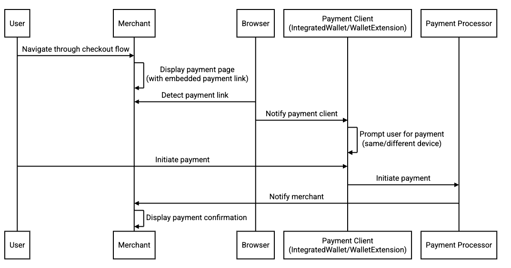

# Support for Payment link type in HTML
Last Update: August 10, 2023


## Terminology
### Push payment - Payment is initiated by the payer (consumer).
#### Examples
- The user scans a merchant QR and completes the payment.
- The user is redirected to an eWallet payment page where they complete the payment.
- The user is redirected to their bank application where they initiate a payment via ACH push.
### Pull payment - Payment is initiated by the payee (merchant).
#### Examples
- The merchant collects the user's credit/debit card details and sends it through a payment processor to charge the user.
- The merchant collects the user's checking account details and initiates a payment via ACH pull.
- The merchant collects the user's IBAN details and sends it through a payment processor to charge the user.
### Payment client - An integrated wallet or a browser wallet extension that is responsible for facilitating payments.
#### Examples
- Google Chrome payment methods backed by Google account (integrated wallet).
- Microsoft Edge payment methods backed by Microsoft account (integrated wallet).
- [MetaMask](https://chrome.google.com/webstore/detail/metamask/nkbihfbeogaeaoehlefnkodbefgpgknn) (browser wallet extension).

## Introduction
Online checkout flows can be broadly classified as push and pull payments\*. A push payment is initiated by the consumer based on information provided by the merchant, whereas a pull payment is initiated by the merchant and collects information from the user.

Certain push payment flows can cause high friction for users (e.g. display of a QR code that the user needs to scan with an eWallet app). Browsers may have the ability to more easily facilitate these payment flows (e.g. if the user has a wallet installed on their device that supports the underlying payment method for the displayed QR, or has a browser extension for the supported eWallet). Currently there is no easy way for browsers to know *passively* if a particular payment method is being offered by the merchant. The *[Payment Request](https://w3c.github.io/payment-request/) API* exists, but it requires active integration (e.g., merchant must explicitly trigger the API, handle communication with it, etc).

We believe there is benefit a 'passive' method to allow browsers to detect push payment flows, to allow users of integrated wallets the option of a better experience. A solution is proposed below to standardize payment links that can be embedded in checkout pages to give an 'alternate' representation of the payment method(s) that the merchant is presenting (in addition to e.g., showing the user a visual QR code, or a login button for an eWallet). This can be accomplished by extending the [link data type](https://html.spec.whatwg.org/multipage/links.html#linkTypes) in HTML. Links are used to define relationships between a document and other resources. This proposal recommends adding a new link type, "payment", to the specification. The "payment" link type would be used to indicate a resource that can be used to make a payment.

\* Pull payments are not in scope for this proposal, but are mentioned to provide clarity on the existing browser solutions for optimizing online checkout experience.

## Goals
- Let the browser assist the user in push payment flows.

## Non-goals
- Pull payments are not in the scope of this proposal. *Payment Request* already exists to support 'active' payment method invocation for pull payments.

## Use cases
- Digital wallets integrated into the browser can detect the presence of a payment page and initiate a push payment for the supported payment methods. A few examples are listed below:
  - Let an integrated wallet handle a push payment when a supported eWallet's payment QR is displayed on a browser window.
  - Let an integrated wallet handle a push payment when a supported central bank payment method QR (PIX, UPI, SGQR, VietQR etc) is displayed on a browser window.
  - Let an integrated wallet handle a push payment when a supported eWallet's login page is displayed on a browser window.
- Browser extensions for payment can detect the presence of a payment page and initiate a push payment for the supported payment methods. Example:
  - Let an open source crypto wallet extension handle a push payment when a supported blockchain's payment QR is displayed on a browser window.
- The above use cases are applicable for same-device and multi-device scenarios. Assuming the payment clients identify all the devices that belong to the user, they will be able to route the payment details to the right place, where the user can then initiate a payment.

## Proposed solution - "payment" link relationship
The "payment" link is expected to follow the standard specifications of a [Link](https://www.w3.org/TR/html401/types.html#h-6.12) type with the *rel* attribute set to "payment".
```html
<link rel=”payment” href="Any URI, where the URI scheme determines the payment method type">
```
The merchant or payment processor can embed this link in the relevant payment pages, hence allowing the browser to optimize the payment experience whenever possible. The browser is responsible for detecting the presence of a "payment" link in any page. It then notifies the payment clients that have registered the associated *scheme* for receiving "payment" links. Some basic validations of the URI might be supported but it is the merchant's responsibility to ensure that the URI conforms to the specification associated with the *scheme*.

### Possible payment sequence using "payment" link
1. User navigates through a checkout flow and selects the push payment method.
2. The merchant displays the payment page. This page may show a QR code or a login screen depending on the merchant configuration. It's also possible for the payment page to be hosted by a payment processor or an eWallet. In this case, the merchant would have done a redirect.
3. Browser detects the "payment" link on the page.
4. Browser notifies the payment clients, passing down the "payment" link.
5. The payment client prompts the user to initiate a payment. This can happen on the same device or a different device depending on the payment client capabilities.
6. The user initiates a push payment on the payment client.
7. The payment client initiates a payment through the underlying payment processor.
7. The payment processor notifies the merchant and the merchant displays a payment confirmation.



### Example "payment" links
#### Bitcoin
- [Specification](https://en.bitcoin.it/wiki/BIP_0021)
- Href URI syntax
  - ```bitcoin:<payee-address>[?amount=<amount>][?label=<label>][?message=<message>]```
- Example
  - ```<link rel=”payment” uri=”bitcoin:175tWpb8K1S7NmH4Zx6rewF9WQrcZv245W?amount=20.3&label=Walmart”>```

As seen above, the *rel="payment"* attribute indicates that this is a payment link. The scheme of the URI, *bitcoin*, indicates the payment method is bitcoin.

#### PIX - Brazilian payment method owned and managed by Brazilian Central Bank
- Href URI syntax
  - ```pix:[?type=<static|dynamic>][?code=<PIX code in TLV format>]```
  - Example
    - ```<link rel=”payment” href=”pix:type=static&code=00020126580014br.gov.bcb.pix0136123e4567-e12b-12d1-a456-4266554400005204000053039865802BR5913John Doe6008BRASILIA62070503***63041D3D”>```

#### eWallets
  - Href URI syntax
    - ```<eWalletlId>:<payee-address|session-token>[?currency=<currency>][?amount=<amount>][?payee-name=<payee-name>][?message=<message>]```
  - Example
    - ```<link rel=”payment” href=”kakaopay:175tWpb8K1S7NmH4Zx6rewF9WQrcZv245W?currency=USD&amount=20.3&payee-name=Walmart”>```

## Privacy considerations
A malicious payment client could use the existence of payment links to track the user. This is an existing concern with e.g., extension based apps (which often ask for permission to view all webpages the user visits), but should be considered for this proposal too.

Browsers should manage payment clients with care; users should be made aware of the risks and be given control over the payment clients in their browser. Certain privacy savvy users may prefer not to let the payment clients get access to their payment info even if they may not contain any sensitive data. Where appropriate, a browser might consider policies around how a payment client can be integrated with that browser (for example, via apps store policies on platforms that have app stores).

## Security considerations
There is a possibility of malicious actors injecting their own "payment" links into web pages and tricking the users into paying them. Standard safety checks done by browsers will offer some level of protection against such attacks. For example, [Safe Browsing](https://safebrowsing.google.com/) feature on Chrome protects the user from known phishing and malware sites. Some additional options that payment clients can consider to mitigate risk are listed below.
- Validate the payment host domain to match against a known list of bad actors.
- Add backend integrations to evaluate the "payment" link and return information that user can review and confirm before initiating the payment.
